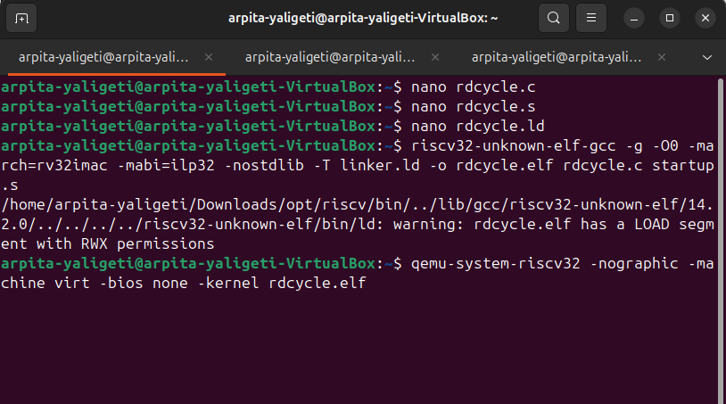
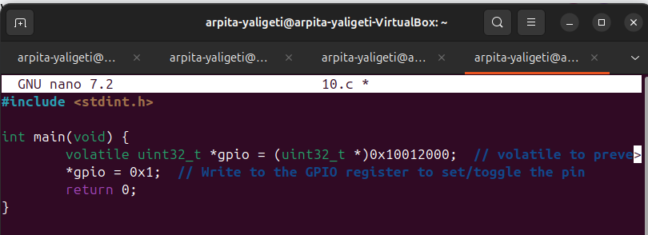
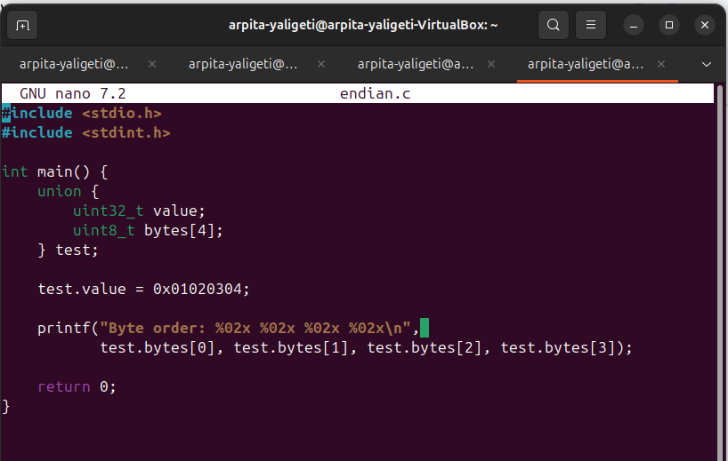

# RISC-V Week 1: Bare-Metal Toolchain, Programming, and Debugging

## 1. 🛠️ Install & Sanity-Check the Toolchain

```bash
tar -xzf riscv-toolchain-rv32imac-x86_64-ubuntu.tar.gz

# Add to PATH
nano ~/.bashrc
# Add this line:
export PATH=/home/arpita_yaligeti/riscv/bin:$PATH
source ~/.bashrc

# Sanity check
riscv32-unknown-elf-gcc --version
riscv32-unknown-elf-objdump --version
riscv32-unknown-elf-gdb --version
```
### Output:


---

## 2. 🧾 Minimal C Hello World

```c
#include <stdio.h>
int main() {
    printf("Hello, RISC-V!\n");
    return 0;
}
```

```bash
riscv32-unknown-elf-gcc -o hello.elf hello.c
file hello.elf
```
### Output:


---

## 3. 🔍 From C to Assembly

```bash
riscv32-unknown-elf-gcc -S -O0 hello.c
```

Prologue: Setup stack, save ra/s0.  
Epilogue: Restore stack, use `ret` to return.

---

### Output:


---
## 4. 🔄 ELF to HEX + Disassembly

```bash
riscv32-unknown-elf-objdump -d hello.elf > hello.dump
riscv32-unknown-elf-objcopy -O ihex hello.elf hello.hex
```

Disassembly format:
```
Address: Opcode Mnemonic Operands
10074:   1141   addi sp, sp, -16
```

### Output:


 Explanation: A typical line in hello.dump might look like:

00010074 <main>:
   10074: 1141             	addi	sp, sp, -16
   10076: c606             	sw  	ra, 12(sp)

10074:	Address — memory address of the instruction
1141	Opcode — raw machine code (hex)
addi sp, sp, -16	Mnemonic + Operands — human-readable instruction

Address	Where in memory the instruction is located
Opcode	The actual binary (in hex) form of the instruction
Mnemonic	The assembly name of the operation (e.g., addi, sw, ret, etc.)
Operands	Registers or immediates the instruction works with (e.g., sp, ra)

---

## 5. 📋 RV32 Register Table

RV32I Register Table
Number     Name     ABI Name                            Description / Role
x0         zero     zero                                Constant 0 (hard-wired zero)
x1         ra       Return Address                      Used to return from function calls
x2         sp       Stack Pointer                       Points to top of stack
x3         gp       Global Pointer                      Points to global data
x4         tp       Thread Pointer                      Thread-local storage
x5         t0       Temporary                           Caller-saved temporary
x6         t1       Temporary                           Caller-saved temporary
x7         t2       Temporary                           Caller-saved temporary
x8         s0       Saved Register / Frame Pointer      Callee-saved, often frame pointer
x9         s1       Saved Register                      Callee-saved
x10        a0       Argument / Return Value             First argument, or return value
x11        a1       Argument / Return Value             Second argument, or return value
x12        a2       Argument                            3rd argument
x13        a3       Argument                            4th argument
x14        a4       Argument                            5th argument
x15        a5       Argument                            6th argument
x16        a6       Argument                            7th argument
x17        a7       Argument                            8th argument
x18        s2       Saved Register                      Callee-saved
x19        s3       Saved Register                      Callee-saved
x20        s4       Saved Register                      Callee-saved
x21        s5       Saved Register                      Callee-saved
x22        s6       Saved Register                      Callee-saved
x23        s7       Saved Register                      Callee-saved
x24        s8       Saved Register                      Callee-saved
x25        s9       Saved Register                      Callee-saved
x26        s10      Saved Register                      Callee-saved
x27        s11      Saved Register                      Callee-saved
x28        t3       Temporary                           Caller-saved temporary
x29        t4       Temporary                           Caller-saved temporary
x30        t5       Temporary                           Caller-saved temporary
x31        t6       Temporary                           Caller-saved temporary


RISC-V Calling Convention Summary

a0–a7 (x10–x17): Function arguments and return values

s0–s11 (x8–x9, x18–x27): Callee-saved registers (must be preserved by the function)

t0–t6 (x5–x7, x28–x31): Caller-saved temporaries (not preserved across function calls)

ra (x1): Return address for ret

sp (x2): Stack pointer — managed by each function’s prologue/epilogue

s0 (x8): Often doubles as frame pointer


---

## 6. 🐞 GDB: Breakpoint & Register Inspect

```bash
riscv32-unknown-elf-gdb hello.elf

(gdb) target sim
(gdb) load
(gdb) break main
(gdb) run
```

Use a minimal C program with no `printf`.

---
### Output:


---

## 7. 🖥️ UART Output with QEMU

Write a UART program using:

1: Write a Minimal Bare-Metal UART Program
```hello2.c

#define UART0 0x10000000

void uart_putc(char c) {
	*(volatile char *)UART0 = c;
}

void uart_puts(const char *s) {
	while (*s) uart_putc(*s++);
}

int main() {
	uart_puts("Printing from UART\n");
	uart_puts("Value of x: 43\n");
	while (1);
}
```
```2: Add a Startup File
startup.s

.section .init
.globl _start

_start:
	la sp, _stack_top
	call main
1:  j 1b

.section .bss
.space 1024
_stack_top:
```
```3: Write a Linker Script (linker.ld)

ENTRY(_start)

MEMORY {
  FLASH (rx) : ORIGIN = 0x80000000, LENGTH = 512K
  RAM   (rwx): ORIGIN = 0x80080000, LENGTH = 512K
}

SECTIONS {
  .text : {
	*(.init)
	*(.text*)
	*(.rodata*)
  } > FLASH

  .data : {
	*(.data*)
  } > RAM

  .bss : {
	*(.bss*)
	*(COMMON)
  } > RAM
}

```
```4: Compile the Program

riscv32-unknown-elf-gcc -g -march=rv32im -mabi=ilp32 -nostdlib \-T linker.ld -o hello2.elf hello2.c startup.s


-nostdlib: Avoid linking with newlib.
-T linker.ld: Use your custom memory layout.4: Compile the Program
```
```5: Verify the ELF File

riscv-none-elf-readelf -h hello2.elf

Check:Machine: RISC-V
Class: ELF32
	Entry point: 0x80000000

riscv-none-elf-readelf -l hello2.elf

Ensure: .text in FLASH with R E
 .data, .bss in RAM with R W
```
```6: Run with QEMU and See UART Output

qemu-system-riscv32 \
  -nographic \
  -machine virt \
  -bios none \
  -kernel hello2.elf
```
---
### Output:


---

## 8. ⚙️ Optimization: -O0 vs -O2

```bash
riscv32-unknown-elf-gcc -S -O0 hello.c -o hello_O0.s
riscv32-unknown-elf-gcc -S -O2 hello.c -o hello_O2.s
```

- `-O0`: debug friendly
- `-O2`: inlines, dead-code removed

---
### Output:


---
-O0: No optimization
	Prioritizes debugging and clarity
	Keeps stack frames, variable assignments, and separate function calls
	Avoids register reuse to make stepping easier in a debugger

 -O2: Aggressive optimization
	Inlines simple functions (like add)
	Removes dead code (e.g., unused result)
	Minimizes memory use, allocates registers smartly
	Avoids unnecessary stack usage
 
---
## 9. ⏱️ Read CSR Cycle Counter

```c
static inline uint32_t rdcycle(void) {
    uint32_t cycles;
    __asm__ volatile ("rdcycle %0" : "=r"(cycles));
    return cycles;
}
```

Compile with linker/startup and run on QEMU.

Explanation: The rdcycle() function uses inline assembly rdcycle %0 to read the cycle counter CSR into a register, then stores it in the C variable cycles.
The constraints "=r"(cycles) tell the compiler to allocate a register for the output and write the result there.
volatile on variables ensures the compiler does not optimize away reads/writes.
main() measures cycles taken by a delay  loop.
The program enters an infinite loop to keep running

### Output:




Expected Output and Behavior:
No output will be printed because there is no I/O.
QEMU will run your program indefinitely without crashing.
The infinite loop in main() keeps the program alive.
You can confirm it ran successfully because QEMU stays open and stable.
To see cycle count values, you’d need to add debug support (e.g., connect via riscv32-unknown-elf-gdb) or implement UART output.

Why No printf?
Your toolchain lacks rdimon.specs or semihosting support.
Linking with -nostdlib and no standard C library avoids unresolved symbols like printf.
This lets you test inline assembly and bare-metal functionality simply.

Explanation of Inline Assembly Constraints:

__asm__ volatile ("rdcycle %0" : "=r"(cycles));
"rdcycle %0" is the assembly instruction reading CSR 0xC00 (cycle counter) into the output register.
"=r"(cycles) means:
=: write-only operand (output).
r: allocate any general-purpose register.
(cycles): store the result in the C variable cycles.
volatile prevents the compiler from optimizing away or reordering the instruction.

1. asm volatile (...): asm is the GCC keyword for embedding assembly code in C.
volatile tells the compiler not to optimize away this assembly block, even if the result is unused.Without volatile, the compiler might remove the instruction during optimization, thinking it has no side effects.

2. "csrr %0, cycle": This is the assembly template.
csrr stands for Control and Status Register Read.
cycle is the CSR number 0xC00, which contains the current CPU cycle count.
%0 is a placeholder for the output operand (which will be replaced by a register, like a0, t0, etc.).

3. : "=r"(c): This is the output constraint section of the inline assembly.
= → Means the operand is write-only (i.e., the assembly code writes to it).
r → Tells GCC to use a general-purpose register to store the result.
(c) → Specifies that the result should be stored in the C variable c.

Together, "=r"(c) tells the compiler:
“Use a register to hold the result of this instruction, and then assign that register’s value to the variable c.”

Element             Meaning
asm                 GCC keyword for inline assembly
volatile            Prevents compiler optimizations/removal
"csrr %0, cycle"    Assembly instruction to read cycle CSR into register 
%0                  Placeholder for the output operand (resolved by GCC to a register)
"=r"(c)             Output constraint: write-only (=), general-purpose register (r), binds to c


 Why Use This ?
Efficiently read the hardware cycle counter without C library support.
Perfect for bare-metal, embedded, or performance timing use cases on RISC-V processors.


---

## 10. 🔁 Toggle GPIO (0x10012000)

```c
volatile uint32_t *gpio = (uint32_t *)0x10012000;
*gpio = 0x1;
```
Use `volatile` to prevent optimization.
Why Use volatile?
The volatile keyword tells the compiler: This variable may change at any time, without the compiler knowing.
So the compiler must: Always read from or write directly to the memory location. Avoid optimizing out what might look like a "redundant" access.
Without volatile, the compiler might assume: uint32_t *gpio = (uint32_t *)0x10012000;
                                             *gpio = 0x1;
                                             *gpio = 0x1; // Might optimize away this second write

Because it sees the same value being written twice — not realizing it's a hardware register.
Alignment Consideration
The uint32_t * type implies 4-byte (32-bit) access alignment. This means:
The address 0x10012000 must be aligned on a 4-byte boundary.
That address is aligned (0x10012000 % 4 == 0), so it's safe.
If the address were unaligned (e.g., 0x10012001), a 32-bit write could cause:
Undefined behavior, or A bus fault, depending on the architecture (e.g., ARM, RISC-V).

---
### Output:


---

## 11. 📜 Linker Script (Minimal)

```ld
SECTIONS {
    .text 0x00000000 : { *(.text*) }
    .data 0x10000000 : { *(.data*) }
}
```
Why Different Addresses for .text and .data?
.text section:
This usually contains program code (instructions). It is typically stored in Flash memory or ROM, which is non-volatile and at a fixed address (here 0x00000000).

.data section:
This contains initialized global/static variables. Since variables must be writable, .data resides in SRAM (RAM), which is volatile memory allowing read-write operations. This is typically mapped at a different higher address (0x10000000 here).

### Output:


---

## 12. 🧬 crt0.S Overview

What Does crt0.S Do in a Bare-Metal RISC-V Program?
crt0.S (short for "C RunTime Zero") is a startup assembly file that runs before main() in a bare-metal environment (i.e., no OS). It's essential for setting up the environment for C code execution.
 Key Responsibilities of crt0.S
Set up the stack pointer (sp): Needed because the C code relies on the stack (e.g., for function calls, local variables).
Usually set to the top of SRAM.
Zero out the .bss section: bss contains uninitialized global/static variables, which must be zeroed according to the C standard.
Copy .data from Flash to RAM (optional): If .data was initialized in Flash, it must be copied to SRAM for run-time use.
Call main(): The real entry point of the application.
Infinite loop (or wfi) after main() exits: In bare-metal systems, you typically don’t return from main().

Example inside `.S` file and `.ld` file to define sections.
### Output:


---

## 13. ⏲️ Machine-Timer Interrupt (MTIP)

- Set `mtimecmp`, `mie`, `mstatus`, `mtvec`
- Write handler in C:
```c
void __attribute__((interrupt)) mtimer_handler(void) {
    *gpio ^= 0x1;
    *MTIMECMP = *MTIME + 1000000;
}
```
### Output:


---

## 14. 🔒 RV32 ‘A’ Extension (Atomic)

Instructions like `lr.w`, `sc.w`, `amoadd.w`, `amoswap.w`, etc. used for safe concurrent memory access.
The ‘A’ (Atomic) extension in RV32IMAC introduces instructions that support atomic read-modify-write operations. These operations are essential in systems where multiple execution threads or processor cores might access and modify the same memory location at the same time. Without atomic instructions, such shared access could lead to race conditions, incorrect program behavior, or system crashes.

The extension adds several key instructions:
lr.w (Load Reserved): Loads a word from memory and marks it for exclusive access.

sc.w (Store Conditional): Attempts to store a word to memory only if no other core or thread has modified it since the corresponding lr.w.

amoswap.w: Atomically swaps a value in a register with a value in memory.

amoadd.w: Atomically adds a value to a memory location.

amoor.w, amoand.w, amoxor.w: Perform atomic bitwise OR, AND, and XOR on memory.

amomin.w, amomax.w, amominu.w, amomaxu.w: Perform atomic min/max operations (signed and unsigned) on memory.

These instructions are particularly useful for implementing synchronization mechanisms such as spinlocks, mutexes, and semaphores. They allow multiple cores or threads to coordinate without the need for disabling interrupts or using complex software-based locking methods. This is important in both operating system kernels and user-level applications that require thread-safe access to shared data.


---

## 15. 🧵 Two-Thread Mutex with `lr.w` / `sc.w`

```c
void lock_mutex(volatile int *lock) {
    int tmp;
    do {
        asm volatile (
            "lr.w %[val], (%[addr])\n"
            "bnez %[val], 1f\n"
            "li %[val], 1\n"
            "sc.w %[val], %[val], (%[addr])\n"
            "1:" : [val] "=&r"(tmp) : [addr] "r"(lock) : "memory"
        );
    } while (tmp != 0);
}
```
### Output:


Explanation: lr.w (Load-Reserved) reads the lock. sc.w (Store-Conditional) writes only if no one else wrote since lr.w. If sc.w fails (returns non-zero), the loop retries — this is the spin-lock behavior. thread_A and thread_B are simulated threads using critical sections. This example is simple and suitable for bare-metal RV32 systems without an operating system or threads

---

## 16. 🖨️ Retarget `printf` using `_write()`

```c
int _write(int file, const char *ptr, int len) {
    for (int i = 0; i < len; i++) {
        while (!(*uart_status_reg & UART_TX_READY_BIT));
        *uart_tx_reg = ptr[i];
    }
    return len;
}
```

Compile with:
```bash
riscv32-unknown-elf-gcc -nostartfiles -T linker.ld crt0.S main.c syscalls.c -o prog.elf -lc -lgcc
```

---

## 17. 🧠 Verify Endianness

```c
union {
    uint32_t value;
    uint8_t bytes[4];
} test;

test.value = 0x01020304;

printf("Byte order: %02x %02x %02x %02x\n",
       test.bytes[0], test.bytes[1], test.bytes[2], test.bytes[3]);
```

Compile:
```bash
riscv32-unknown-elf-gcc -march=rv32imac -mabi=ilp32 endian.c -o endian.elf
qemu-riscv32 ./endian.elf
```
### Output:



---
